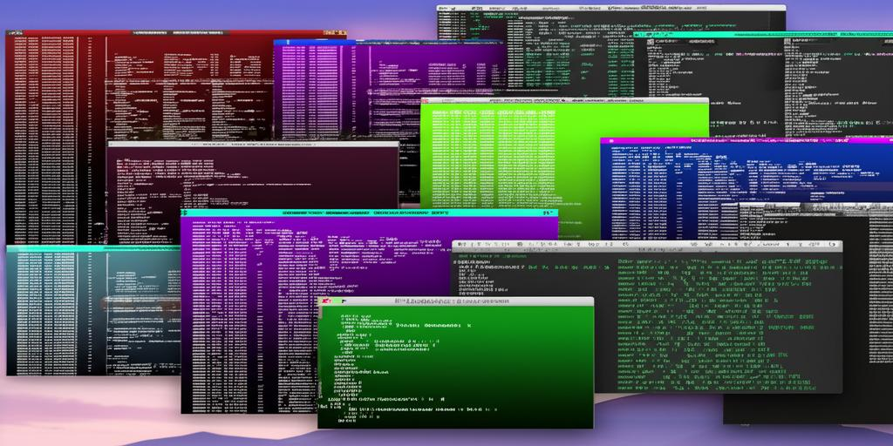

# Terminal Utilities for macOS



## Purpose

This script provides utilities for managing Terminal themes on macOS. It allows you to:

*   Save all your current Terminal themes as individual `.terminal` files.
*   Reset your Terminal to the default theme set.
*   Generate multiple new color-based Terminal themes based on specified parameters.

## How to Use

The script is a command-line tool. Open your Terminal application and navigate to the directory where you saved the script.

### Save Themes

To save all your current Terminal themes as `.terminal` files in a folder named 'Terminal files' within your Downloads folder, run:

```bash
./terminal_utils.py save
```

### Reset to Default Themes

To reset your Terminal to its default themes, removing any custom themes you have created, run:

```bash
./terminal_utils.py default
```

**Note:** You might need to restart Terminal for the changes to fully take effect.

### Generate Color Themes

To generate new color-based Terminal themes, run:

```bash
./terminal_utils.py colors
```

This will generate a set of themes with varying hues, brightness, and saturation and automatically import them into your Terminal. You can then select these themes via Terminal > Settings > Profiles.

#### Options for Generating Color Themes

*   `--num`: Specifies the number of themes to generate. Default is 30.
*   `--max-saturation`: Specifies the maximum saturation for the background colors. Default is 0.4.  Values range from 0.0 (grayscale) to 1.0 (full color).

Example:

To generate 50 themes with a maximum saturation of 0.6, run:

```bash
./terminal_utils.py colors --num 50 --max-saturation 0.6
```

## Installation

1.  Save the script (e.g., as `terminal_utils.py`) to a directory of your choice.
2.  Make the script executable:

    ```bash
    chmod +x terminal_utils.py
    ```

3.  (Optional) Add the script's directory to your `PATH` environment variable for easier access from any Terminal location.

## Examples

*   Save your current themes:

    ```bash
    ./terminal_utils.py save
    ```

*   Reset to default themes:

    ```bash
    ./terminal_utils.py default
    ```

*   Generate 20 themes with default saturation:

    ```bash
    ./terminal_utils.py colors --num 20
    ```

*   Generate 40 themes with a maximum saturation of 0.8:

    ```bash
    ./terminal_utils.py colors --num 40 --max-saturation 0.8
    ```

## License

This project is licensed under [CC BY-NC 4.0](https://darren-static.waft.dev/license) - free to use and modify, but no commercial use without permission.
